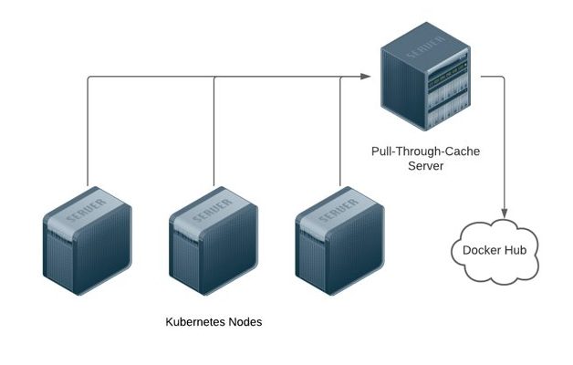

# Pull-Through-Cache - HA with Kubernetes



## Prerequisites​

- A Kubernetes cluster​
- A Storage Class that supports RWX​
- An external tcp load balancer​

NOTE: This should be deployed on an infrastructure cluster that can be bootstrapped without Pull-Through-Cache

## Installation

### Deploy the namespace

```
kubectl apply -f 01-namespace.yaml
```

### Deploy the storage

NOTE: This example uses [longhorn-nfs](https://longhorn.io/docs/1.0.2/advanced-resources/rwx-workloads/) this should be changed to another storageclass that can support [RWX](https://kubernetes.io/docs/concepts/storage/persistent-volumes/#access-modes).

```
kubectl apply -f 02-pvc.yaml
```

### Deploy the secret

NOTE: This should be updated with your Docker Hub login and you should try to use an [access token](https://docs.docker.com/docker-hub/access-tokens/) in-place of a password.

```
echo -n 'auth.docker.io:Username:Password' | base64)
kubectl apply -f 03-secret.yaml
```

### Deploy the app

NOTE: This app is a [DaemonSet](https://kubernetes.io/docs/concepts/workloads/controllers/daemonset/) so it will run on all nodes. You can use [taints](https://kubernetes.io/docs/concepts/workloads/controllers/daemonset/#taints-and-tolerations) to limit the app to a set of nodes.

### Setup the TCP load balancer

You should work with your networking/load balancer team to create a load balancer with the following settings.

- Mode: Layer 4
- Protocol: TCP
- Port: 3128
- Load‑balancing method: Round Robin
- Health check: HTTP GET / with a 200 OK

## Credit

This is based on [https://github.com/rpardini/docker-registry-proxy](https://github.com/rpardini/docker-registry-proxy)
